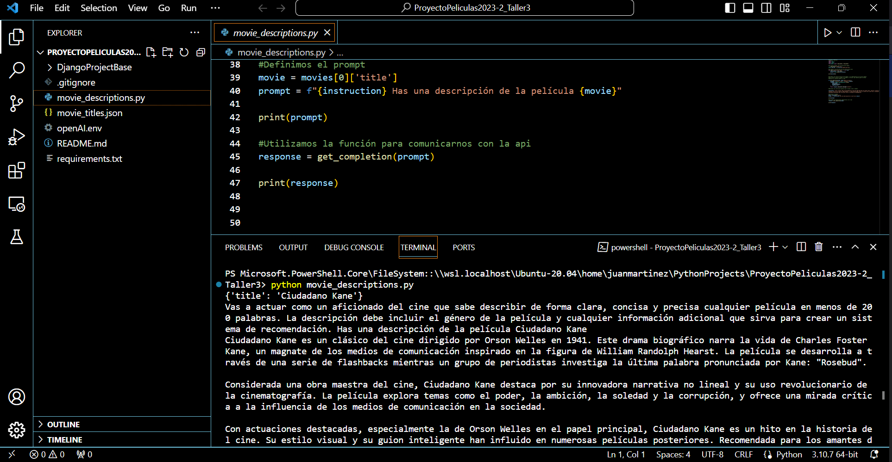
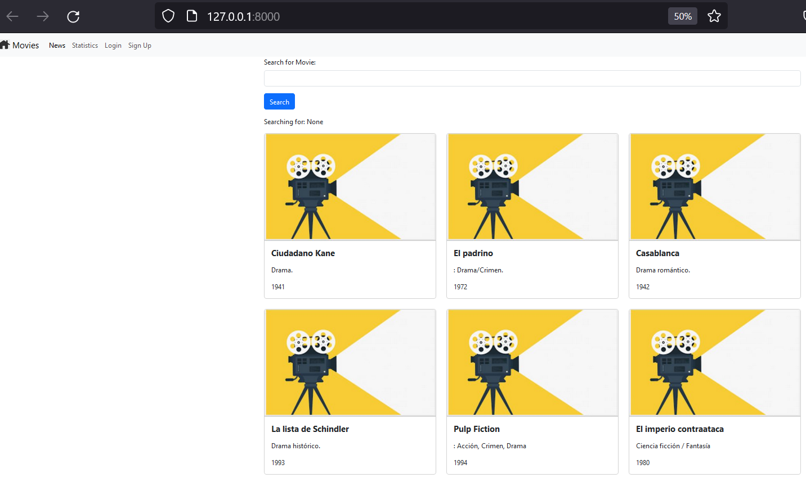
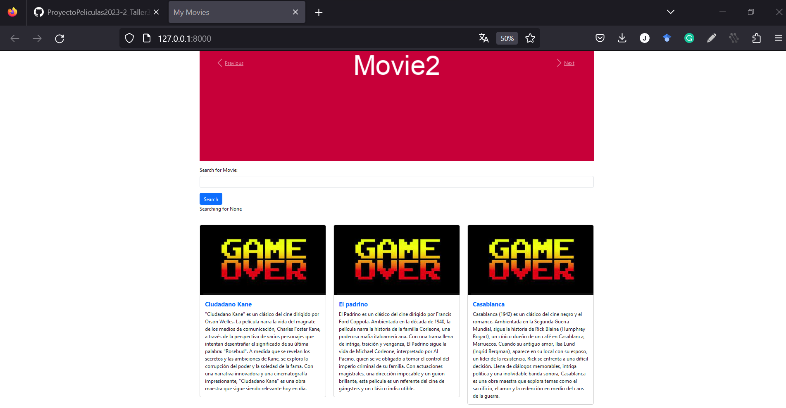
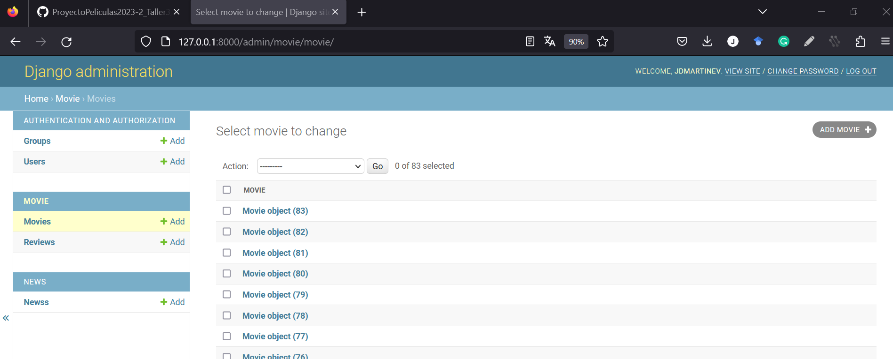

## Descripciones de películas

En esta etapa del proyecto se utilizará la API de OpenAI para generar descripciones de algunas películas que se agregarán a la base de datos.
Para esto, el archivo ``movies.json`` que se utilizó en el workshop 2 tiene una lista de películas a las que se le agregará información.

El archivo [movie_descriptions.py](movie_descriptions.py) muestra los pasos para utilizar la API de OpenAI para obtener la descripción de las películas en la lista.
En este archivo se pueden ver dos funcionalidades principales:

1. Definición de una función auxiliar (__get_completion__) para comunicarse con la API
2. Creación de un __prompt__ que nos ayuda a pedir de forma correcta la descripción de las películas

Ejecute el script, para esto debe dirigirse en la consola a la ubicación del archivo y escribir:

````bash
python movie_descriptions.py
````

Cuando ejecute el script, deberá ver en la consola algo de la siguiente forma:




Puede ver que se imprime el nombre de la película, el prompt completo y la descripción obtenida.

Al ejecutar todo el script (incluyendo las lineas comentadas) se genera el archivo ``movie_descriptions.json``
que se va a utilizar para alimentar la base de datos de películas. En este caso, por tiempo, no se va a ejecutar el script completo y el archivo resultante se puede consultar en [movie_descriptions.json](movie_descriptions.json)


Ahora se utilizará la información del archivo [movie_descriptions.json](movie_descriptions.json) para agregar items a la base de datos. Para esto nos vamos a dirigir a la carpeta ``DjangoProjectBase``. Asumiendo que la consola está en el directorio raíz del proyecto ``Taller3-PI1``, escriba lo siguiente:

````shell
cd DjangoProjectBase
````
Si ejecuta el servidor se dará cuenta que este es el proyecto que se creó en el workshop 2 con algunas modificaciones a la lista de películas

````shell
python manage.py runserver
````


Ahora dentro de la carpeta de la app movie debe crear una carpeta management y dentro de esta una carpeta commands. Después, debe crear el archivo add_descriptions_db.py.


Este archivo se utilizará para pasar la información del archivo ``movie_descriptions.json`` a la base de datos de películas de la aplicación de Django. El contenido de este archivo se encuentra en [add_descriptions_db.py](aux_files/add_descriptions_db.py)

Una vez haya terminado estos pasos y copiado el contenido del archivo [add_descriptions_db.py](aux_files/add_descriptions_db.py) en ``movie/management/commands/add_descriptions.py``, en la consola va a ejecutar el siguiente comando:

````shell
python manage.py add_descriptions_db
````
Cuando termine de ejecutarse, debe ver un mensaje como el siguiente:


Puede ejecutar el servidor y verá algo de la siguiente forma:



Además puede ir a la página de administrador 127.0.0.1:8000/admin/ y cuando ingrese con las credenciales podrá observar que las películas quedaron correctamente almacenadas en la base de datos. Además, puede ingresar a alguna de ellas y ver la descripción


